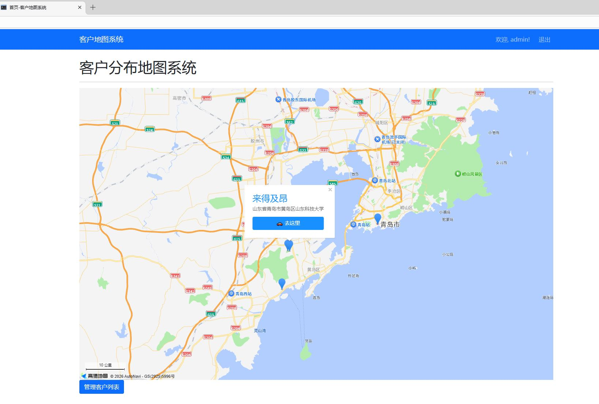

# 客户地图管理系统 (Flask + MySQL + Bootstrap)

基于Flask开发的客户管理 Web 应用，集成高德地图，支持客户位置可视化、一键导航、批量导入导出、地址解析失败重试等完整业务功能。

## 技术栈

后端Python + Flask + SQLAlchemy + Flask-Migrate
数据库 MySQL
前端HTML + CSS + JavaScript + Bootstrap5 （手机端适配）
地图服务 高德地图Web API（地理编码、地图展示）
数据处理 pandas（导入导出数据Excel/CSV文件）


## 功能亮点

用户认证 – 注册/登录，每个用户只能看到自己的客户数据
地图显示 – 所有客户在地图上以标记点展示，点击标记可查看详情
一键导航 – 点击客户标记后，可选择高德/百度/腾讯地图 App 或网页版进行路线规划
搜索筛选 – 支持按客户姓名、手机号搜索
批量导入 – 上传 Excel 或 CSV 文件，批量添加客户（自动跳过标题行）
批量导出 – 支持导出为 CSV 或 Excel 文件
地址解析（地理编码） – 新增客户时自动调用高德 API 将地址转为经纬度；提供“重试失败”功能，可一键修复之前解析失败的客户
响应式布局 – 手机和电脑都能正常使用


## 项目结构

```
map_project/
├── app/
│   ├── __init__.py            # 应用工厂（create_app）
│   ├── models.py              # 数据库模型
│   ├── service.py             # 业务逻辑（导入导出、地理编码重试等）
│   ├── map.py                 # 地图相关路由
│   ├── auth.py                # 登录注册路由
│   └── utils.py               # 工具函数（如判断文件格式、安全转字符串）
├── templates/                 # HTML 模板
├── static/                    # 静态文件 空
├── migrations/                # 数据库迁移记录
├── .env                       # 环境变量（密钥、API Key）
├── config.py                  # 配置文件
├── run.py                     # 应用入口
└── requirements.txt           # 依赖列表
```

简单说明： app/models.py 定义了数据库模型，app/service.py 定义了业务逻辑，app/map.py 定义了地图相关路由，app/auth.py 定义了登录验证登录路由，app/utils.py 定义了工具函数，config.py 定义了配置文件，.env 定义了环境变量（密钥、API Key），run.py 是应用入口，requirements.txt 是依赖列表，create_user.py 是创建管理员用户脚本(开发者使用)，test_xp_mysql.py 是测试数据库连接脚本。

## 运行项目

1. 克隆项目
   ```bash
   git clone https://github.com/Ljyliu/flask-mapapi.git
   cd 你的项目名
   ```
2. 创建虚拟环境
   ```bash
   python -m venv venv
   source venv/bin/activate  # Windows: venv\Scripts\activate
   ```
3. 安装依赖
   ```bash
   pip install -r requirements.txt
   ```
4. 配置环境变量
    ！！！ 注意去高德官网申请密钥，并把密钥放在 .env 文件中
    需要四个密钥：web服务端密钥、web端服务端安全密钥（私钥）、web端密钥、web端安全密钥
    复制 .env.example 为 .env，填入你的高德 API Key 和数据库连接信息

5. 初始化数据库
   ```bash
   flask db init
   flask db migrate -m "初始迁移"
   flask db upgrade
   ```

6. 创建管理员用户（可以看脚本内注释）
    ```bash
    python create_user.py
    ```

7. 运行项目
    ```bash
    python run.py
    ```
访问http://127.0.0.1:5000/即可使用。


## 界面预览
电脑端


移动端


# 后续计划

· 用 FastAPI 重构，利用异步特性提升性能
· 集成 Elasticsearch 优化搜索 或postgresql 优化搜索
· 增加 Celery 异步任务（如后台导入）
· 加入 AI 行程规划（调用大模型生成出行建议）